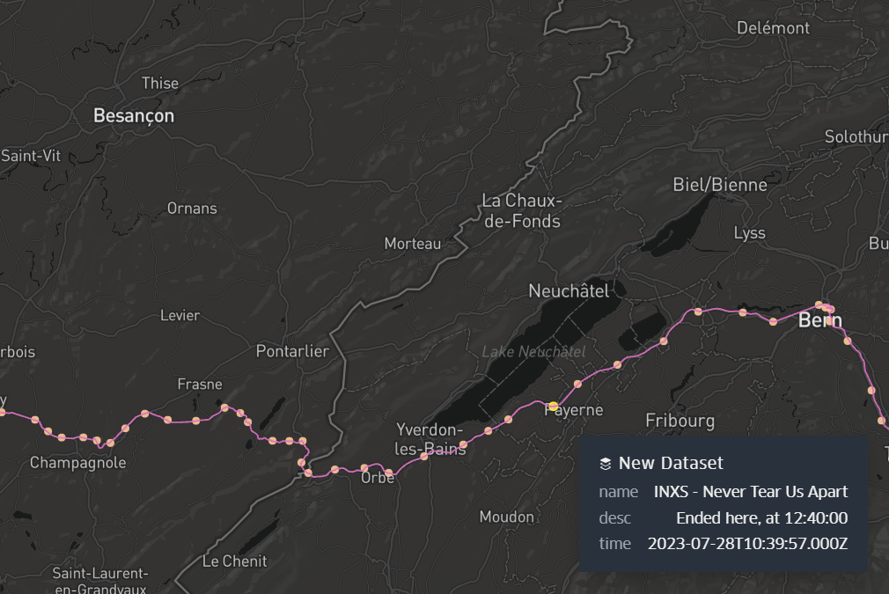
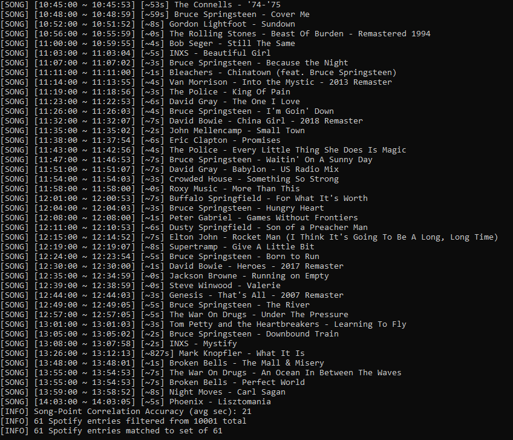
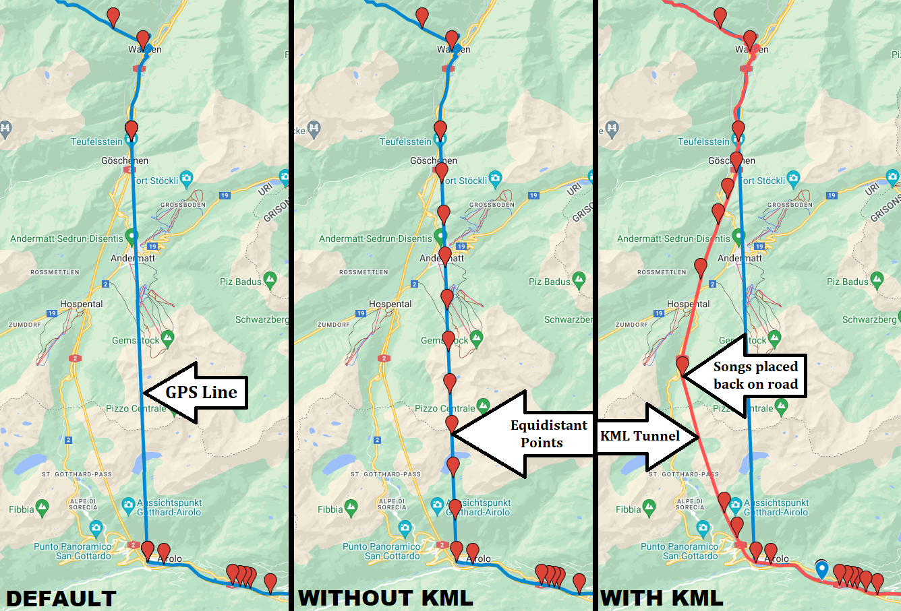

# SpotifyGPX

Create GPX waypoints based on timed GPX tracks and Spotify listening history. Great for road trips!

## Example

Here is an example render using [kepler.gl](https://github.com/keplergl/kepler.gl) with the original GPX track included:

## Requirements

You must have the following:

For using SpotifyGPX:
 - .NET Framework 4.7.2 installed
 - the `Newtonsoft.Json` DLL in the running directory
 - a GPX file of a tracked journey with timings
 - listened to Spotify during the GPX journey
 - the JSON of Spotify history covering the journey

For use with Spotify as data source:
 - access to the Spotify account you listened with
 - [downloaded](https://www.spotify.com/account/privacy/) your Spotify listening history JSON

For use with GPX as the tracked GPS format:
 - your journey, tracked in GPX (if not, [convert other formats to GPX](https://www.gpsvisualizer.com/convert_input))
 - the GPX, containing frequent `<trkpt>` objects, as well as `lat`, `lon`, and `<time>`, for each

## Usage

> `SpotifyGPX <json_file> <gpx_file> [-j] [-p] [-n]`

 - `SpotifyGPX` - SpotifyGPX executable
 - **Required:** `json_file` - Path to a Spotify listening history JSON
 - **Required:** `gpx_file` - Path to a GPX file
 - *Optional:* `-n` - Do not export a GPX from the calculated points
 - *Optional:* `-j` - Save off the relevant part of the Spotify JSON
 - *Optional:* `-p` - Export a `xspf` playlist of the songs
 - *Optional:* `-s` - Export a `txt` list of Spotify URIs and copy it to clipboard (can be pasted into Spotify Desktop app playlists)
 - *Optional:* `-g` - Enable point prediction for this run. See below for guidance. **Cannot be used with `-n`**

## Obtaining Necessary Data

**Spotify:**
 1. Ensure you listened to Spotify on the applicable journey
 2. [Download](https://www.spotify.com/account/privacy/) your `Account data` or `Extended streaming history` data JSON (this will take a few days for them to process and send)

**GPS Data:**
 1. Use an app such as [GPSLogger](https://github.com/mendhak/gpslogger) to track your position
 2. Ensure the frequency of points is high, since a song is tied to each point

## Console Example

## Point Prediction

**What is it?**

SpotifyGPX has a built-in point prediction class that allows multiple songs spanning the same point to be distributed along the route, as opposed to overlapping one another.

**When should it be used?**

This is useful if there is a gap in GPS track data spanning longer than one song (ie. tunnel passage with no GPS reception but continued song playback) or GPS track points captured otherwise too infrequently.

**How is it accomplished?**

By identifying the first point with a duplicate coordinate, and the last point of the same coordinate, and equally spacing out all implicated points between the beginning and end of the missing path.

**Modes:**
 1. *Default* - No point prediction. Multiple songs spanning same point overlap first point
 2. *Without KML* - Equidistant point prediction. Multiple songs spanning same point distributed equally until next unique coordinate
 3. *With KML* - Provided KML of road path, multiple songs spanning same point placed on the coordinates of the road from the KML

**Provide KML Path** for use with road path:

Example: `route.gpx`
KML path of road from [Google MyMaps](https://www.google.com/mymaps): `route_Spotify.kml`

**Note:** If this file does not exist, and program is run with `-g`, equidistant placement will be used.

**Example Comparison:**

