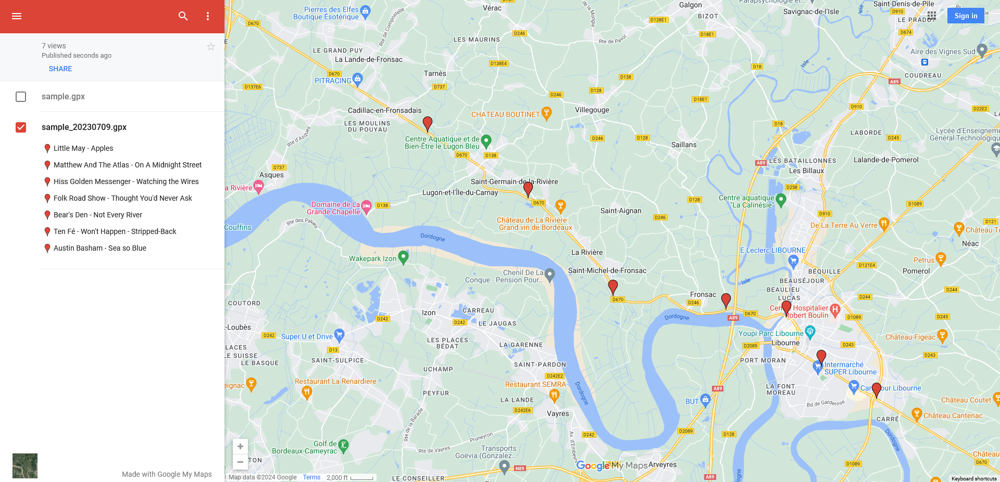
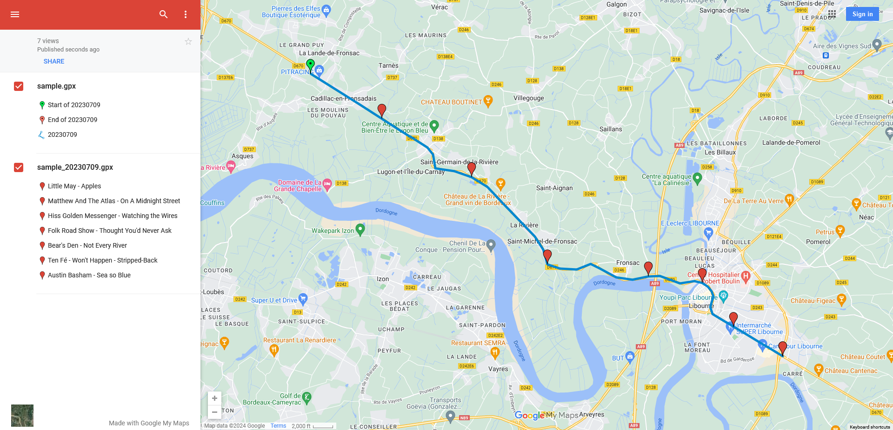
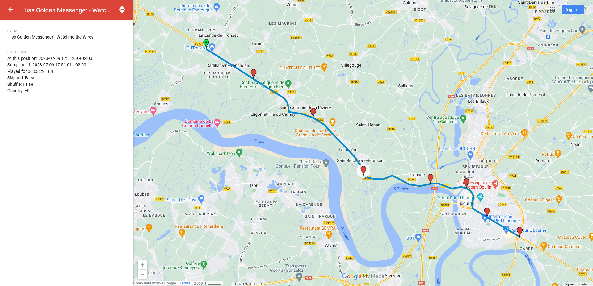

# SpotifyGPX

## Sample data

The following values have been nullified for privacy:

 - Username
 - IP Address

### Data fed to SpotifyGPX

Both of these files were fed to SpotifyGPX:

 - [Spotify data dump JSON](sample.json)
 - [Original GPX tracking session](sample.gpx)

Here is the original GPX journey track visualized:

### SpotifyGPX output

SpotifyGPX generated the following files with the above data:

| Origin | Target | no XSLT | [XSLT](../SpotifyGPX/Xslt/) |
| ------ | ------ | ------- | --------------------------- |
| CSV | [-c](sample_20230709.csv) | [-x](sample_20230709.csv.xml) | [-x](sample_20230709.csv.html) |
| GPX | [-g](sample_20230709.gpx) | [-x](sample_20230709.gpx.xml) | [-x](sample_20230709.gpx.html) |
| JSON | [-j](sample_20230709.json) | [-x](sample_20230709.json.xml) | [-x](sample_20230709.json.html) |
| JsonReport | [-r](sample_All.jsonreport) | [-x](sample_All.jsonreport.xml) | [-x](sample_All.jsonreport.html) |
| KML | [-k](sample_20230709.kml) | [-x](sample_20230709.kml.xml) | [-x](sample_20230709.kml.html) |
| TXT | [-t](sample_20230709.txt) | [-x](sample_20230709.txt.xml) | [-x](sample_20230709.txt.html) |
| TXT | [-t](sample_20230709.txt) | [-x](sample_20230709.txt.xml) | [-x](sample_20230709.txt_nolink.html) (nolink) |
| XSPF | [-p](sample_20230709.xspf) | [-x](sample_20230709.xspf.xml) | [-x](sample_20230709.xspf.html) |
| XLSX | [-e](sample_All.xlsx) | Unsupported | Unsupported |

Here is the [GPX](sample_20230709.gpx) (containing song points), generated by SpotifyGPX:

Here is the [SpotifyGPX song points GPX (above pictured)](sample_20230709.gpx) overlayed on top of the [tracked path it was based on](sample.gpx):

Here is a single song point from the [SpotifyGPX-generated output](sample_20230709.gpx):

