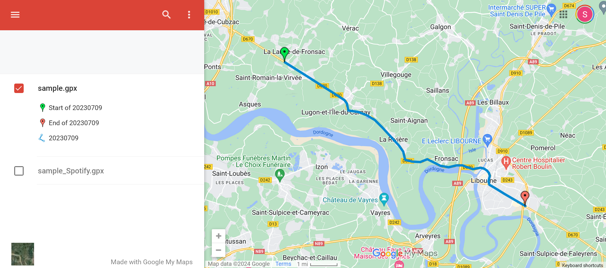
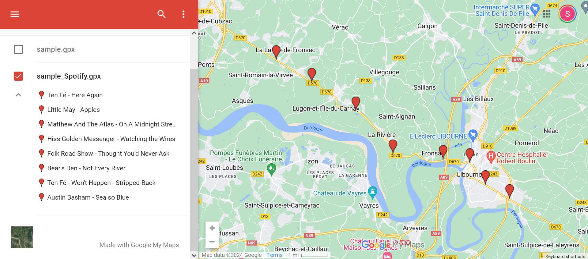
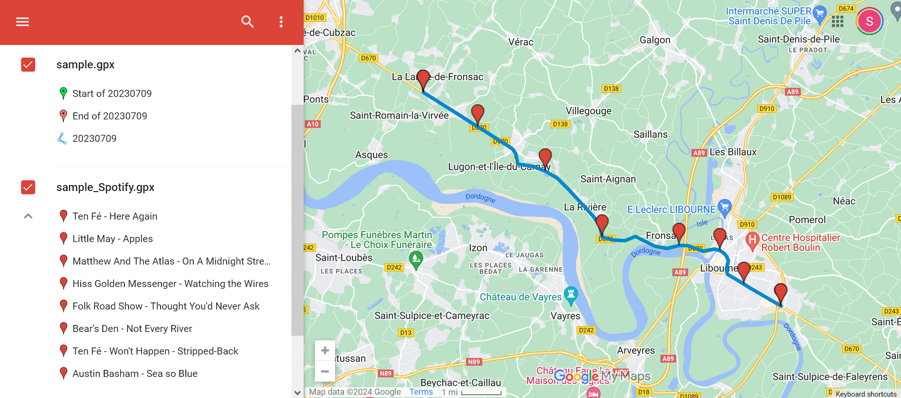
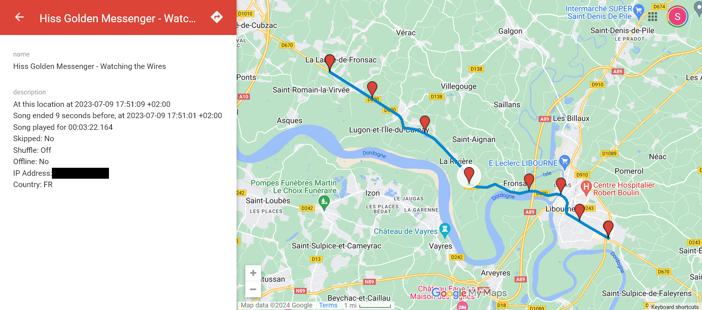

# SpotifyGPX

## Sample data

The following values have been nullified for privacy:

 - Username
 - IP Address

### Data fed to SpotifyGPX

Both of these files were fed to SpotifyGPX:

 - [Spotify data dump JSON](sample.json)
 - [Original GPX tracking session](sample.gpx)

Here is the tracking path visualized:

### SpotifyGPX output

SpotifyGPX generated the following files with the above data:

 - [GPX generated by SpotifyGPX (pictured)](sample.Spotify.gpx)
 - [JSON chunk of relevant objects](sample.json)
 - [XSPF playlist of the songs](sample_Spotify.xspf)
 - [TXT list of Spotify URIs](sample_Spotify.txt)

Here is the GPX (containing song points), generated by SpotifyGPX

Here is the SpotifyGPX song points GPX (above pictured) overlayed on top of the tracked path it was based on:

Here is a single song point from the SpotifyGPX-generated output:

